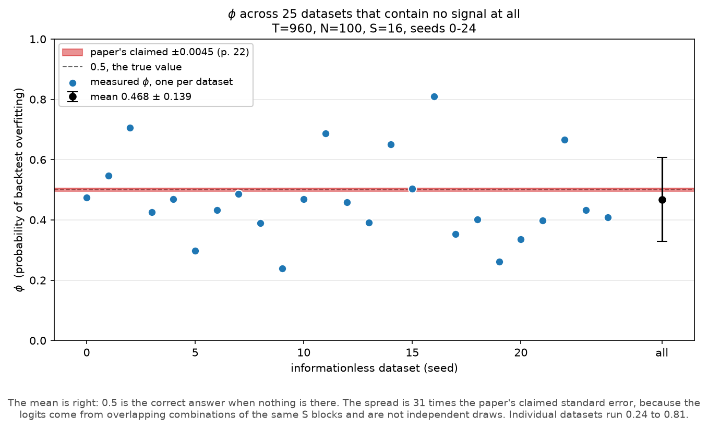
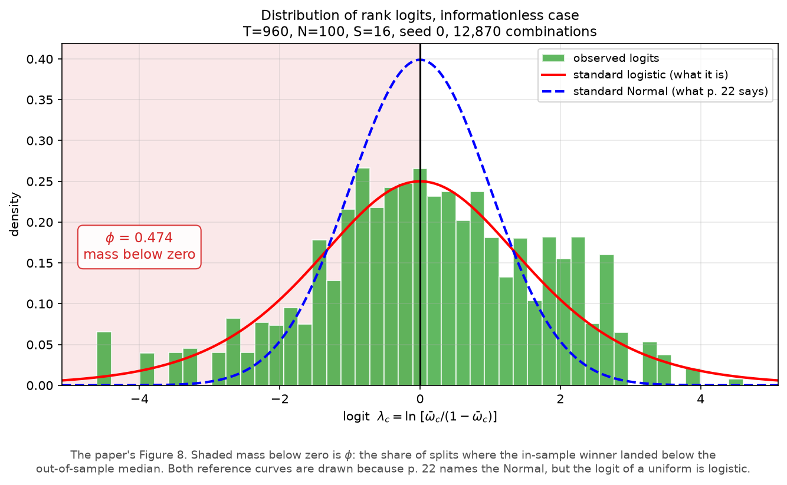
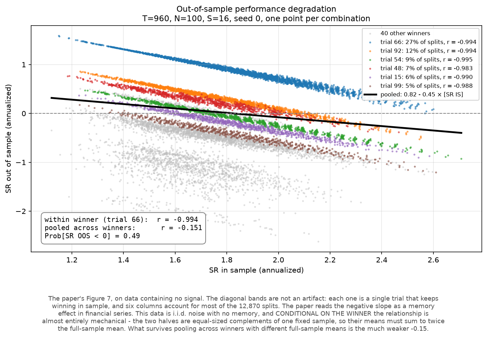

# Deflated Sharpe Ratio and Probability of Backtest Overfitting

Two tests for whether a backtest survived a search or merely won one.
Reproduces both papers to four decimals.

**Contents**

1. [Problem and scope](#1-problem-and-scope)
2. [Methods](#2-methods)
3. [Verification](#3-verification)
4. [Findings](#4-findings)
5. [Implementation](#5-implementation)
6. [Usage](#6-usage)
7. [Limitations](#7-limitations)
8. [References](#8-references)

---

## 1. Problem and scope

### 1.1 The problem

You try 400 variations of a trading strategy on historical data. The best one
earns 2.5 times its own risk. On paper that is an excellent result. But is it
skill, or just the best of 400 coin flips?

In a backtest the two look the same. Capital gets allocated on backtests, and
published ones almost never say how many variations were tried before the
winner was picked. Search hard enough and something spectacular always turns
up. Whether anything real is behind it is a separate question.

### 1.2 Scope of this work

- Both methods built from the source papers and reproduced to four decimals
  against their published figures.
- Published claims checked by simulation rather than taken on trust. Section 4
  lists the ones that failed, each with the measurement behind it.
- 144 tests and CI. Units cannot be constructed wrongly. Every number quoted
  here is pinned by a test to the code that produces it.

### 1.3 Summary of findings

Matching the published figures to four decimals means checking every constant
and definition on the way. That turned up seven problems in the PBO paper. The
DSR paper came through clean.

None of this would be findable if the papers were not written the way they are.
Both specify their procedures in enough detail to re-derive every number, which
is what makes an independent check possible at all. Most papers do not clear
that bar.

The biggest is Finding 4.1. The PBO paper states a standard error for its own
estimator that is about thirty times too small.



*Figure 1. Each dot is φ, the estimated probability of overfitting, measured on
a dataset with no signal in it. The right answer is 0.5 and the mean lands
there. The red strip is the precision the method's own paper claims.*

---

## 2. Methods

### 2.1 Deflated Sharpe Ratio

Asks how good a result has to be before the size of the search stops explaining
it. Even with no skill anywhere, the best of N trials still beats zero by
luck alone. That expected maximum becomes the hurdle. Try more configurations
and the bar goes up.

### 2.2 Probability of Backtest Overfitting

Asks whether the winner keeps winning on data it was not selected on. Split the
sample into equal halves every way you can. For each split, find the winner on
one half and check where it ranks on the other. φ is the share of splits where
it lands below the median.

### 2.3 Relationship

These are complementary, not redundant. DSR is parametric and asks about
magnitude. PBO is rank-based and asks about stability. A strategy that clears
one but fails the other is worth a second look.

---

## 3. Verification

### 3.1 DSR against the published worked example

| Quantity | Paper (p. 10) | This code |
|---|---|---|
| SR₀ at N=100 | 0.1132 | 0.1132 |
| DSR at N=100 | 0.9004 | 0.9004 |
| DSR at N=46 | 0.9505 | 0.9505 |
| DSR at N=88, Normal returns | 0.9505 | 0.9505 |

One step there is worth recording. The PDF's text layer destroys the Greek
letters and every equation. Rebuilding the worked example from the prose alone
put the trial variance at 1/100, and at that value every case returns
DSR = 1.0000. Rendering p. 9 as an image settles it. The disclosure reads
`V[{SR̂ₙ}] = 1/2`.

The lesson is to rasterize before reconstructing:
`pdftoppm -jpeg -r 200 -f 9 -l 10 paper.pdf p`.

### 3.2 PBO against known baselines

| Case | Expected φ | Measured |
|---|---|---|
| No signal in any trial | 0.5 | 0.468 mean over 25 datasets |
| One trial with a real edge | near 0 | below 0.05 |

Three further properties are asserted straight against the algorithm as
specified: the combination count, the complementarity of the train and test
sets, and the finiteness of the logit.

---

## 4. Findings

### 4.1 The CSCV standard error is understated by a factor of about thirty

PBO paper, p. 22, puts the standard error of φ under **0.0045** at S=16. It
gets there with σ = √(p(1−p)/n), where n is the number of logits. That formula
assumes independent draws. But the logits come from overlapping combinations of
the same S row blocks, so they are heavily dependent. The effective sample size
is governed by S, not by C(S, S/2).

Measured over 25 informationless datasets at T=960, N=100, S=16:

| Statistic | Value |
|---|---|
| Mean φ | 0.468. The right answer under the null is 0.5, so this is correct |
| Standard deviation | **0.139** |
| Range across datasets | 0.24 to 0.81 |
| Paper's claimed σ | 0.0045 |

Figure 1 shows this directly. The red strip is the claimed standard error and
the dots are the measured values.

Dropping to S=12 gives 924 combinations, a fourteenth as many. The spread barely
moves: 0.144. Independent draws would have shrunk it by √14 ≈ 3.7×. Raising the
combination count buys almost nothing, and that is the signature of dependence.

This has a practical cost. Page 13 suggests rejecting models with PBO above
0.05, which reads like a sharp cut-off. On a single dataset it is nothing of
the kind.

### 4.2 Definition 2.2 contradicts the paper's own logit

Definition 2.2 (p. 10) writes PBO as `Prob[r̄ₙ < N/2]`. Under the null the rank
is uniform on 1..N, so that expression gives:

| N | Via the logit | Via Definition 2.2 |
|---|---|---|
| 10 | 0.500 | 0.400 |
| 50 | 0.500 | 0.480 |
| 100 | 0.500 | 0.490 |
| 101 | 0.495 | 0.495 |

Never 0.5, which is the right answer when the in-sample winner carries no
information. What the paper actually computes is the mass of the logit
distribution below zero. That tests `r̄/(N+1) < ½`, which gives exactly 0.5 at
every even N and (N−1)/2N at odd N, as close to a half as discreteness allows.
The odd case falls short because one rank lands exactly on the median, so
ω̄ = ½, the logit is zero, and strict inequality excludes it.

The two forms differ by exactly one rank at even N and coincide at odd N. This
implementation follows the logit.

### 4.3 C(16,8) is 12,870, not the printed 12,780

PBO paper, pp. 11 and 22. Two things say this is a typo rather than a different
definition. The paper's own Eq. (2.3) product form gives 12,870. And its S=24
figure of 2,704,156 is exactly C(24,12).

### 4.4 Informationless logits are logistic, not Normal

Page 22 says they approximate the standard Normal. But the logit of a uniform
is standard logistic, with σ = π/√3 = 1.814. Measured over 8 seeds at the
suite's lighter configuration of T=480, N=50, S=12, it comes out at
1.583 ± 0.248. That sits below the logistic because discrete ranks truncate
both tails. It is nowhere near the Normal's 1.0. Figure 2 below plots the
heavier T=960, N=100, S=16 case.



*Figure 2. The paper's Figure 8 with both candidate reference curves drawn. The
shaded mass below zero is φ.*

### 4.5 The degradation slope is attributed to the wrong cause

§3.2 explains the negative in-sample against out-of-sample slope through memory
effects in financial series. Part of it is mechanical instead. The two halves
are complements of one fixed sample, so a split that puts the lucky rows in the
training half must leave them out of the testing half. The slope shows up in
pure i.i.d. noise, which has no memory at all, and it is negative in about 90%
of draws.



*Figure 3. The paper's Figure 7 on data containing no signal, coloured by which
trial won in sample. Each diagonal band is a single column; six of them account
for most of the 12,870 splits.*

Colouring by winner sharpens the claim considerably. Conditional on the winner
the relationship is not partly mechanical but almost entirely so:
**r = -0.994 within the top band against -0.151 pooled.**

The reason is exact. A column's two half-means must sum to twice its
full-sample mean, down to floating point. So the Sharpe pair departs from a
slope of -1 only because the two halves have different standard deviations.
Pooling across winners leaves the much weaker -0.151, and even that figure
flips sign across configurations.

Pinned by `test_degradation_is_mechanical_conditional_on_the_winner`.

### 4.6 Two textual inconsistencies

| Location | Issue |
|---|---|
| Algorithm 2.3, step (c) | Calls J "the testing set" after step (a) defined it as the training set. Step (d) resolves it: (c) is in-sample. |
| Definition 2.2 and §3.1 vs Conclusions | The former say the optimal strategy underperforms the *median* out of sample, the latter says the *mean*. Only the median has a rank-based estimator, and that is what φ computes. |

---

## 5. Implementation

### 5.1 Modules

| Module | Contents |
|---|---|
| `src/psr.py` | Probabilistic Sharpe Ratio, Minimum Track Record Length |
| `src/dsr.py` | Expected maximum Sharpe under the null, Deflated Sharpe Ratio |
| `src/trials.py` | Average correlation, effective number of independent trials |
| `src/pbo.py` | CSCV, Probability of Backtest Overfitting |
| `src/audit.py` | Composition: trial matrix in, both verdicts out |
| `scripts/make_figures.py` | Regenerates Figures 1 to 3 |

### 5.2 Units

An earlier version guarded the trial dispersion with a plausibility threshold.
That cannot work. The error being detected is a factor of `periods_per_year`,
so how big it looks depends on the frequency. An absolute threshold does not.
At 250 periods a year a mistaken annualised 0.5 implies an annualised
dispersion of 11.2. At 12 periods the same mistake implies 2.4, which is
indistinguishable from a merely wide sweep.

So `SharpeStats` and `TrialSet` each declare their own frequency, and
`deflated_sharpe_ratio` checks the two agree. That comparison is exact. There
is no margin to erode.

### 5.3 Moment conventions

Kurtosis is non-excess here, so a Normal is 3.0. That matches the (γ₄−1)/4
term. scipy defaults to Fisher and would quietly understate the penalty.

Moments use the biased estimators. That choice is tied to the Pearson guard and
cannot be made separately. Biased sample moments satisfy γ₄ ≥ γ₃² + 1
identically, so `from_returns` can never trip the guard. The equality is exact
for n=2 samples, which is why the guard carries a 1e-9 tolerance.

Unbiased moments do not satisfy it. Over 5,000 small fat-tailed samples the
slack reaches -3.99 against a biased minimum of +5.5e-4. Mixing the conventions
would make the guard reject ordinary data.

### 5.4 Where Eq. (1) is not used

Above the measured crossover at N = 2.7752, Eq. (1) overestimates the expected
maximum by +0.036 at N=10 and +0.023 at N=100. That raises the hurdle, which is
the safe direction to err in.

Below the crossover the sign flips. At N=2 it understates by 0.044. Below
N=1.2836 it returns a negative correction, which would put the expected maximum
beneath the mean. Understating the threshold raises DSR and makes the tool
permissive in exactly the regime it exists to police. So below the crossover
the exact order statistic `∫ z·N·φ(z)·Φ(z)^(N−1) dz` is integrated instead.

That region is reachable rather than theoretical. M=100 at ρ̂=0.98 gives
N = 2.98.

The branch switches at `EXACT_BRANCH_BELOW = 3.0` rather than at 2.7752. The
integral is exact on both sides, so the constant only decides where to stop
using the cheaper approximation. The small-N warning fires only on the Eq. (1)
branch.

### 5.5 M > T warns rather than refusing

The DSR paper (p. 15) calls the correlation matrix ill-conditioned there. That
concern is aimed at methods which invert or decompose it. An equal-weighted
average does neither. Each pairwise correlation still rests on T observations
however many columns exist.

Measured over 30 seeds at M/T = 33, ρ̂ = 0.8002 ± 0.0312. Essentially unbiased.
What degrades is the dispersion, and `effective_num_trials` multiplies it by M.
At M=1650 that puts N̂ anywhere between 218 and 457 against a true 331. So the
warning names the dispersion rather than the bias.

### 5.6 Smaller decisions

| Decision | Reason |
|---|---|
| Effective trial count is a float | N̂ interpolates between two regimes rather than counting anything, and Eq. (1) is continuous in N. |
| Average correlation as ‖Z1‖²/T | The sum of all entries is what Eq. (8) needs, available in O(TM). At M=20,000 the explicit matrix is 3.2 GB. |
| CSCV requires S to divide T exactly | Unequal blocks would make the two halves different sizes, destroying the symmetry the method is named for. The PBO paper's own example fails this: T=1000 at S=16 is 62.5 rows per block. |
| ω̄ divides the rank by N+1, not N | Ranks run 1..N, so ω̄ stays inside [1/(N+1), N/(N+1)] and the logit cannot reach ±∞. |
| DSR hurdle uses a trial mean of zero | DSR tests H₀: SR = 0. The observed mean asks a harsher question, whether the winner beats the expected best of a class already assumed to have skill. It is reported separately. |

---

## 6. Usage

### 6.1 Install and test

```bash
pip install -r requirements.txt
python -m pytest tests/ -q          # 144 passed
```

Run it from the project root. Imports are `from src.psr import ...`, and
`python -m pytest` puts the root on `sys.path` where plain `pytest` may not.
`src/__init__.py` is empty on purpose. Deleting it breaks the imports.

Almost all the runtime is `test_pbo.py`, which contributes 36 of the 144 tests
but two thirds of the wall clock. It repeats CSCV across seeds because φ on a
single dataset has a standard deviation of about 0.14. For a fast edit loop use
`python -m pytest tests/ -q --ignore=tests/test_pbo.py`, which runs the other
108 in a fraction of the time.

### 6.2 Example

```python
from src.audit import audit

result = audit(trial_returns, periods_per_year=250)   # T x M, all trials
print(result.summary())
```

```
trials run                 400
average correlation        0.791
effective independent      84.4
selected trial             #85
  Sharpe (annualized)      0.31
  skew / kurtosis          0.08 / 3.20
  observations             960
hurdle SR0 (annualized)    0.59
Deflated Sharpe Ratio      0.2904
Probability of Overfitting 0.3852
OOS probability of loss    0.7455
```

That is 400 correlated backtests on pure noise. Both tests agree there is
nothing there, and they get there by different routes.

The inputs sit next to the verdicts on purpose. A DSR quoted without the trial
count and the dispersion behind it repeats the very omission the DSR paper
exists to attack.

---

## 7. Limitations

**Both statistics are noisy on a single dataset.** Under the null DSR is a
p-value and should be roughly uniform. Across 8 informationless datasets it
ranges from 0.01 to 0.89 with a mean of 0.485. PBO ranges from 0.37 to 0.81.
The means are right. The individual readings are not verdicts. Every
statistical test here averages across seeds for that reason.

**PBO must never become an optimisation target.** The PBO paper's own warning
(§5.2, p. 25) applies with full force. Using it to select a strategy is a misuse
that reintroduces the overfitting it measures.

**Figures use a heavier configuration than the test suite.**
`scripts/make_figures.py` builds Figures 1 to 3 from fixed seeds 0 to 24 at
T=960, N=100, S=16. Its values are committed to `figures/phi_dispersion.json`,
and `tests/test_figures.py` checks them against the numbers quoted here so the
images and the text cannot drift apart.

The suite itself measures the same effects at T=480, N=50, S=12 over 12 seeds,
because generating the figures costs several times what the whole suite does.
The claim is identical. Only the cost is not.

**Stochastic dominance is not implemented.** §3.3 of the PBO paper defines a
fourth statistic which is out of scope here. `CSCVResult.perf_oos_all` stores
the full out-of-sample surface so it stays reachable without recomputation.

---

## 8. References

1. Bailey, D. and M. López de Prado (2014). *The Deflated Sharpe Ratio:
   Correcting for Selection Bias, Backtest Overfitting and Non-Normality.*
   Journal of Portfolio Management 40(5), 94-107.
   SSRN [2460551](https://ssrn.com/abstract=2460551).
2. Bailey, D., J. Borwein, M. López de Prado and Q. J. Zhu (2015). *The
   Probability of Backtest Overfitting.* Working paper, revised February 2015.
   SSRN [2326253](https://ssrn.com/abstract=2326253).
3. Bailey, D. and M. López de Prado (2012). *The Sharpe Ratio Efficient
   Frontier.* Journal of Risk 15(2). Source of the Probabilistic Sharpe Ratio
   used in Section 5.3.
4. Lo, A. (2002). *The Statistics of Sharpe Ratios.* Financial Analysts Journal
   58(4), 36-52. Derivation of the standard error the PSR rests on.